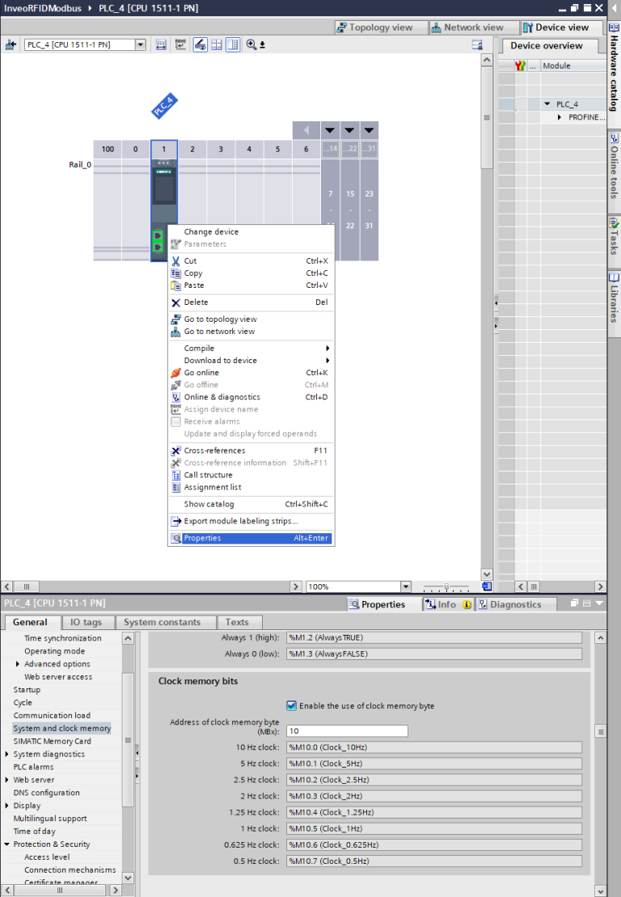
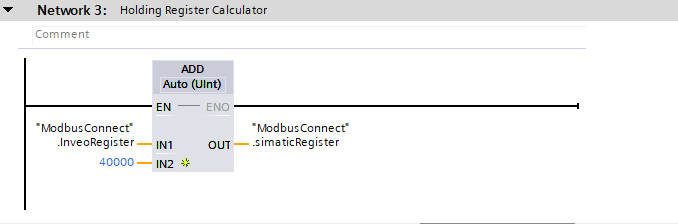
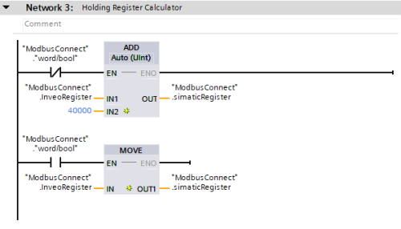

# **#3 HOWTO**

#  **How to integrate Siemens S7 PLC and Inveo RFID IND LED/LCD reader using Modbus TCP/IP**

S7 PLC configuration

This tutorial is intended to demonstrate the process of configuring the Inveo IND RFID reader with Siemens S7-300/S7-1200/S7-1500 controllers using Modbus TCP/IP protocol. 

We start by creating a new project and selecting a controller - it can be any controller from the S71200/S71500 family and selected S7300/S7400 models. In our case, it will be a 1511-1 unit.

Ensure that the reader and the controller are on the same network.

In our case it will be:

*   S7-1500 - IP: 192.168.0.10
    
*   Inveo Box ID reader - IP: 192.168.0.2
    

We start by creating a function block to handle the Modbus TCP/IP communication protocol, in my case it will be called **“Modbus”**. After creating it, we can call it in **“OB1**”.

The next step is to call the MB\_CLIENT function block inside the **“Modbus”** block, which you will find under **“Communication” -> “Others”**. Ultimately, we will need to use four such blocks - two for reading **“Holding Registers”** and **“Single Coils”** and two for writing them. For now, let's focus on the block for reading **“Holding Registers”** data.

When the block is called, you will see the inputs marked in red for the data necessary for configuration and connection establishment - without filling them, the program will not compile. Therefore, we need to create a data block with configuration data.

In the block, we create the following variables:

**"MbTCPClientRead** ‘ and **’MbTCPClientWrite** ” are structures for configuring network settings. The other variables are auxiliary variables for disconnecting Modbus and facilitating work on registers.

The structures should be filled in as below, the parameter **“InterfaceId”** will depend on the hardware network ID - you can check its value by going into the driver settings **“properties”** **\-> “System constants”** in our case it is 64. The **“ADDR”** array is the IP address of our reader, **“RemotePort”** is the communication port, 502 is the standard port for Modbus TCP/IP.

Let's create another block, where we will already store data for reading and writing **“Holding Registers** ” via Modbus.

It is important that the block on which the register reading and writing operations will be performed is properly configured. We need to disable the optimization of the block will result in the addition of an **“offset”** column in the data block.

After configuring the block settings, you need to create an array in which we will store data. In my case, it will be called **“DataRegisters”** and will store 50 elements of type Word. After creating the array, we can connect it to the **“MB\_DATA\_PTR”** input of the **“MB\_CLIENT”** block. This is the pointer that we need to pass in order to read the data.

The next step is to assign the variables we created from the **“ModbusConnect** ‘ and **’ModbusData** ‘ blocks to the **’MB\_CLIENT”** block .

The last item needed to complete the configuration of the block for reading data is to connect the clock to the input **“REQ”**. Setting a high state to the **“REQ”** input

will cause data reception. The data will update every second - if you need faster data updates you can use a clock with a higher frequency.

If you haven't configured hardware clocks in your project then you need to do so to get the desired effect.

As a reminder, to configure hardware clocks you need to go into **“Properities” -> “System and clock memory”** then you need to activate the checkbox **“Clock memory bits”** and set the initial Tag mapping the area of clocks in memory.

The block for reading data has been correctly configured, now with a few simple steps we will create a second block for writing data. Copy **“MB\_CLIENT”** and assign the variables for reading data in the appropriate fields.

Copy the block to another network and replace the data in the **"MB\_DATA\_PTR** ‘ and **’CONNECT** ” fields with the data for writing, respectively. Since the block will be used for writing data, you need to change the mode, i.e. the **"MB\_MODE** ” parameter to 1, which means write. The last operation required for correct data writing via Modbus is to set the clock state inversion in the **“REQ”** field. - Inversions are performed to prevent data from being sent and received simultaneously, we need to create a kind of interlock, which will make data received and sent alternately.

One more summing block needs to be added to convert IND reader registers to S7 controller registers. This is a fairly simple operation, here we add 40000 to the Inveo IND reader register because the addressing for **“Holding Registers”** starts with 40000.

IND reader configuration

It is time to configure the Inveo IND reader. The operation of this reader is done entirely through the built-in web server. When you connect to the reader for the first time, you should enter its default IP in the browser: 192.168.111.15. During this operation, make sure that our network card is in the same class as the reader.

After connecting to the reader we will be asked for a login and password, the default login credentials are:

**login - admin**

**password- admin00**

It is recommended that you change the login and password so that unauthorized people do not have access to change the configuration of the device.

When using our **Discoverer** application, our network card may be on a different subnet than the reader.

After logging in to the device, let's go to the Network tab. Let's change the reader's default IP address to what our application requires. At first, we assumed that it will be 192.168.0.2. After saving the data with the “Save” button, the network settings will be saved and the reader will restart.

After configuring the reader's network, you still only need to activate Modbus TCP/IP in the **“Administration”** tab:

Communication test

After performing these two above steps on the reader's web server, we should be able to correctly transfer data between devices. After uploading the software to the controller and displaying the preview, we should see the statuses of the blocks switch every second to the values 7004 and 7006, respectively, which means correct data transmission.

Working with registers

Of course, remember to set the initial address of the array from which you want to read data. Remember to set the high state of the **“MbDisconnect”** variable before changing the value of the **“InveoRegister”** variable. - then after making the change set the low state back.

In the above way we realize access to the memory **“Holding Registers”**. There is still an area left **“Single Coils”**, it will be useful for controlling outputs, reading input states and monitoring the system, among other things. To realize access to this area, we need to create a new data block, which we will call **“SingleCoils”**. In its case, too, we need to disable optimization

Inside the block, we create an array of type bool of size 50 

We will still need to create an auxiliary variable, the state of which will determine the reading/writing of data in the “Holding Registers” and **“Single Coils”** areas. We can create the variable in the **“ModbusConnect”** block, it will be called **“word/bool”**. So we copy the **“MB\_CLIENT”** block for reading data and replace the **“MB\_DATA\_PTR”** parameters with **“SIngle Coils”**. To the **“EN”** input of both blocks we enter the variable **“word/bool”** with negation in block one, this operation is to prevent reading data at the same time.

We perform a similar operation on blocks for recording data. As you can see, the clock has been changed to 10Hz - this will allow for faster reading and writing of data.

We should also remember to handle the register values, which are located in network 3. Depending on which memory area we want to access, we need to perform a separate operation, in the case of **"Holding Registers"** we will add 40000, and in the case of **"Single Coils"**. ” we will just rewrite the value.

Setting the high state to **“word/bool”** will enable write operations and 

reading in the **“Single Coils”** area. For tests, we can control the relay outputs:

Error table

In case of problems with establishing communication between devices, check the statuses we receive when trying to receive/send data and analyze them in terms of the error table available below:

Ending

If you have reached this step, it means that you have correctly configured the Inveo IND reader with the S7 driver, congratulations! We hope that our solution will work in many applications.